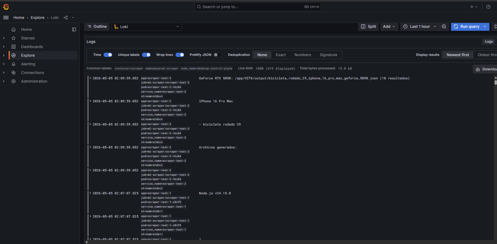
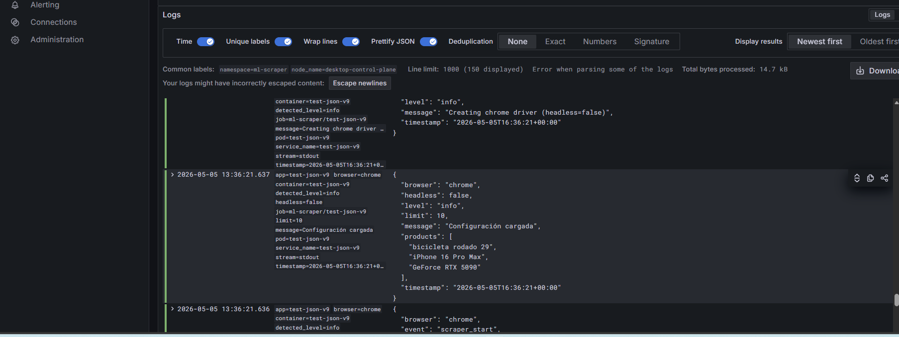
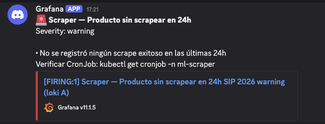

# Observability - TP 2 Parte 1: Loki + Promtail + Grafana

Este directorio contiene la configuración para el stack de logging centralizado usando Loki, Promtail y Grafana.

## Estructura

```
observability/
├── README.md                    ← cómo levantar el stack en una corrida
├── helm/
│   ├── loki-values.yaml         ← values pinneados del chart de Loki
│   ├── promtail-values.yaml     ← values de Promtail con scrape config
│   └── grafana-values.yaml      ← admin secret refs + datasource provisionado
├── manifests/
│   ├── namespace.yaml           ← namespace `observability`
│   ├── grafana-secret.yaml      ← SOLO con placeholder, NO el secret real
│   └── grafana-nodeport.yaml    ← Service NodePort 30000
├── dashboards/
│   └── scraper-overview.json    ← dashboard provisionado as-code (Hit #5)
├── queries/
│   └── logql-cookbook.md        ← las 5+ queries del Hit #4 documentadas
└── install.sh                   ← script idempotente con todos los pasos
```

## Requisitos Previos

- Cluster k3s/k3d operativo con al menos 6 GB de RAM libre y 8 GB de disco
- Helm 3 instalado (helm version ≥ 3.16)
- TP 1 Parte 2 entregado: scraper corriendo como Job + CronJob

## Instalación

```bash
# Setear la variable de entorno requerida
export GRAFANA_ADMIN_PASSWORD='<tu-password-seguro>'

# Ejecutar el script de instalación
cd observability && ./install.sh
```

Output esperado:
```
✓ Loki running
✓ Promtail running
✓ Grafana running
✓ Datasource Loki configurado
✓ Dashboard 'Scraper Overview' provisionado
→ Abrir http://<node-ip>:30000  (admin / <GRAFANA_ADMIN_PASSWORD>)
```

## Acceso a Grafana

- URL: `http://<node-ip>:30000`
- Usuario: `admin`
- Password: el valor de `GRAFANA_ADMIN_PASSWORD`

## Hits Implementados

### Hit #1 - Deploy del stack Loki + Promtail + Grafana ✅
- Loki en modo single-binary con storage local (5Gi PVC)
- Promtail como DaemonSet recolectando logs
- Grafana con datasource Loki provisionado
- Service NodePort 30000

### Hit #2 - Recolección de logs del scraper con labels Kubernetes ✅
- Promtail refinado para namespace `ml-scraper`
- Labels Kubernetes: app, pod, container, namespace, job_name, node
- Filtro por `app=scraper` para excluir otros pods (ej: postgres)
- Path al log file: `/var/log/pods/*/`

**Validación:**
```bash
helm upgrade promtail grafana/promtail \
  --version 6.16.0 \
  --namespace observability \
  --values observability/helm/promtail-values.yaml

# Queries para probar en Grafana → Explore:
{namespace="ml-scraper", app="scraper"}
{namespace="ml-scraper", app="scraper", job_name="scraper-test-1"}
```

**Screenshot requerido:** `observability/screenshots/hit2-labels.png`

### Hit #3 - Migrar el scraper a logs JSON estructurados ✅

**Cambios realizados en el scraper (Node.js/Winston - HIT5/):**

1. **`HIT5/src/utils/logger.js`** — Adaptado para JSON:
   - Console transport → `winston.format.json()` (para stdout → kubectl logs → Loki)
   - DailyRotateFile transport → texto plano (para archivos locales, NO va a Loki)

2. **Call-sites adaptados** en archivos de HIT5/:
   - `HIT5/src/scrapers/mercadolibre.js`
   - `HIT5/src/pages/HomePage.js`
   - `HIT5/src/pages/SearchResultsPage.js`

**Antes (Hit #2 - texto plano):**
```javascript
logger.info(`Query: "${query}" | Browser: ${browserName}`);
```



**Después (Hit #3 - JSON estructurado):**
```javascript
logger.info("Query iniciada", { 
  producto: query, 
  browser: browserName, 
  event: "query_start" 
});
```

**Resultado en stdout (JSON line-delimited):**
```json
{"level":"info","message":"Query iniciada","producto":"iPhone 16 Pro Max","browser":"chrome","event":"query_start","timestamp":"2026-05-04T22:00:00.000Z"}
```

**Validar JSON output con LogQL:**

Después de redeployar la imagen del scraper y disparar un Job:
```
{namespace="ml-scraper", app="scraper"} | json
```

En Grafana → Explore, panel **"Detected fields"** deben aparecer:
- `level`
- `producto`
- `browser`
- `logger`
- `message`
- `event` (campo estructurado agregado)



**Screenshots obligatorios (consigna):**
- `observability/screenshots/hit2-labels.png` — log line plain text (antes)
- `observability/screenshots/hit3-json-fields.png` — log line JSON con campos extraídos (después)

**Nota importante:** La consigna da ejemplos en Python (`logging_setup.py`) porque es genérica, pero **este proyecto usa Node.js/Winston**. Los cambios se aplicaron en `HIT5/` (el scraper real que se despliega en k8s).

### Hit #4 - LogQL cookbook: 5+ queries útiles ✅
- `observability/queries/logql-cookbook.md` con las 5 queries mínimas documentadas
- Cada query tiene: pregunta de negocio, query LogQL, ejemplo de output, explicación

### Hit #5 - Dashboard Grafana provisionado as-code ✅
- `observability/dashboards/scraper-overview.json` — dashboard exportado y provisionado vía ConfigMap
- Carpeta "SIP 2026" en Grafana con 7 paneles: 3 stat, 2 time series, 1 table, 1 logs
- Queries Q1–Q5 del cookbook integradas

**Screenshot requerido:** `observability/screenshots/hit5-dashboard.png`

### Hit #6 - Alertas vía Discord (Bonus +5%) ✅

#### Setup

```bash
# Setear la URL del webhook de Discord (nunca commitear este valor)
export DISCORD_WEBHOOK_URL="https://discord.com/api/webhooks/..."

# Ejecutar install.sh (crea el secret y el ConfigMap automáticamente)
export GRAFANA_ADMIN_PASSWORD='<tu-password>'
./install.sh
```

#### Reglas provisionadas (as-code)

**Archivo:** `observability/manifests/alert-rules.yaml`

| Regla | Condición | Severidad |
|-------|-----------|-----------|
| Fallos Consecutivos | ≥2 `scraper_failed` en 10 minutos | critical |
| Dato Desactualizado | 0 scrapes exitosos en 24h | warning |

#### Cómo validar el disparo (testing acelerado)

Para no esperar 24h, modificar temporalmente el umbral de la regla `scrape-stale-24h` en `alert-rules.yaml`:

```yaml
# Cambiar [24h] → [10m] y > 86400 → > 600 para prueba rápida
expr: 'sum(count_over_time({namespace="ml-scraper", app="scraper"} | json | level="INFO" | message="Scrape completado" [10m]))'
```

Luego suspender el CronJob para que no lleguen logs nuevos:
```bash
kubectl -n ml-scraper patch cronjob scraper-hourly -p '{"spec":{"suspend":true}}'
```

Esperar 10 minutos → Grafana → Alerting → Alert rules debería mostrar estado "Firing" → Discord recibe la notificación.

Restaurar:
```bash
kubectl -n ml-scraper patch cronjob scraper-hourly -p '{"spec":{"suspend":false}}'
```

#### Secret Management

El webhook URL de Discord **nunca** se guarda en el repositorio. Se gestiona mediante:
- Variable de entorno `DISCORD_WEBHOOK_URL` en el entorno local
- Kubernetes Secret `discord-webhook` en el namespace `observability` (creado por `install.sh`)
- `gitleaks detect` como gate en el pipeline de CI

**Screenshot:** `observability/screenshots/hit6-discord-alert.png`



## Validación Post-Instalación

```bash
# 1) Verificar pods running
kubectl -n observability get pods,ds,svc,pvc

# 2) Verificar Loki responde
kubectl -n observability port-forward svc/loki 3100:3100 &
curl -sG http://localhost:3100/loki/api/v1/labels

# 3) Verificar Grafana datasource
curl -u admin:"$GRAFANA_ADMIN_PASSWORD" \
  http://<node-ip>:30000/api/datasources/name/Loki
```

## Troubleshooting

- **loki-stack chart deprecado**: NO usar grafana/loki-stack, usar charts separados
- **Cardinality explosion**: No usar labels con alta cardinalidad (request_id, trace_id)
- **Promtail no encuentra logs**: Verificar paths en /var/log/pods/
- **Grafana No data**: Cambiar time range a "Last 24 hours"
- **Scraper logs no son JSON**: Verificar que `winston.format.json()` esté en el Console transport
