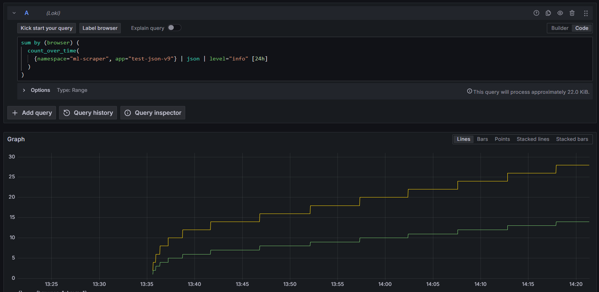
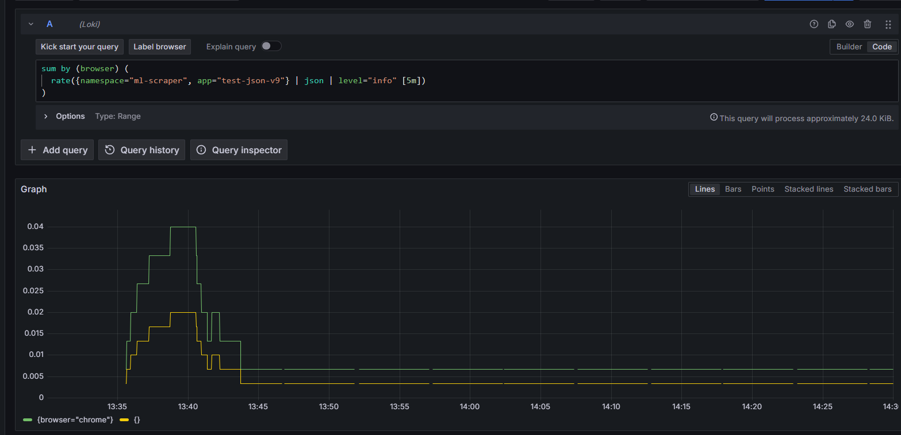

# LogQL Cookbook - TP 2 Parte 1

Queries útiles para el scraper basadas en logs centralizados en Loki.

## Diferencia entre Log queries y Metric queries

**Log queries** (queries de logs): Devuelven logs crudos o filtrados. Se usan para inspección visual.
- Ejemplo: `{namespace="ml-scraper"} | json | level="ERROR"`
- No generan series temporales, solo muestran líneas de log.

**Metric queries** (queries métricas): Transforman logs en métricas usando funciones como `rate()`, `count_over_time()`, `avg_over_time()`. Se usan para graficar y alertas.
- Ejemplo: `rate({namespace="ml-scraper"} | json | level="ERROR" [5m])`
- Generan series temporales con valores numéricos.

**¿Cuándo usar cuál?**
- Debugging rápido → Log queries
- Dashboards, tendencias, alertas → Metric queries

---

## Q1 — Top errores por producto en las últimas 24h

**Pregunta**: "¿Qué producto está fallando más?" — útil para priorizar bugfixes de selectores.

```logql
sum by (producto) (
  count_over_time(
    {namespace="ml-scraper", app="scraper"} | json | level="ERROR" [24h]
  )
)
```

**Por qué esta query**: Usa `count_over_time` en lugar de `rate` porque queremos contar errores absolutos, no una tasa por segundo. `sum by (producto)` agrupa por producto para identificar cuál falla más.

**Output esperado**: Tabla con columnas `producto` y valor numérico de errores.



---

## Q2 — Tasa de WARNINGs por minuto en la última hora

**Pregunta**: "¿Hubo un pico de errores de retry hace 30 min?" — visual para detectar incidentes en curso.

```logql
sum by (producto) (
  rate({namespace="ml-scraper", app="scraper"} | json | level="WARNING" [1m])
)
```



**Por qué esta query**: `rate` es apropiado aquí porque queremos ver la velocidad de aparición de warnings (eventos por segundo), útil para dashboards en tiempo real. Ventana de [1m] suaviza fluctuaciones.

**Output esperado**: Time series graph mostrando warnings/minuto por producto.

---

## Q3 — Conteo de filtros que no aparecieron por producto

**Pregunta**: "¿Qué productos pierden el filtro tienda_oficial?" (ML lo oculta dinámicamente).

```logql
sum by (producto) (
  count_over_time(
    {namespace="ml-scraper", app="scraper"}
      | json
      | message =~ "Filtro .* no disponible"
    [7d]
  )
)
```

**Por qué esta query**: Usa regex `=~` para matchear el patrón de mensaje. `count_over_time` con ventana de 7 días da visibilidad histórica. Agrupado por producto para comparar.

**Output esperado**: Tabla con productos y conteo de filtros faltantes.

---

## Q4 — Duración media entre intentos de retry

**Pregunta**: "¿El backoff exponencial está disparando como esperamos?"

```logql
avg_over_time(
  {namespace="ml-scraper", app="scraper"}
    | json
    | message=~"intento.*backoff"
    | unwrap delay_ms
  [1h]
)
```

**Por qué esta query**: `avg_over_time` calcula el promedio de `delay_ms` (extraído con `unwrap`). Requiere que el Hit #3 emita el campo `delay_ms` como número. Ventana de 1h captura suficientes reintentos.

**Output esperado**: Valor numérico del promedio de delay en ms.

---

## Q5 — Última corrida exitosa por producto

**Pregunta**: "¿Hace cuánto que no scrapeo exitosamente cada producto?" — base para alertas.

```logql
topk by (producto) (
  1,
  count_over_time(
    {namespace="ml-scraper", app="scraper"} 
      | json 
      | level="INFO" 
      | message="Scrape completado"
    [24h]
  )
)
```

**Por qué esta query**: `topk(1, ...)` devuelve el log más reciente (top 1) por producto. Combinado con `by (producto)` da la última corrida exitosa de cada uno. `message="Scrape completado"` filtra solo éxitos.

**Output esperado**: Logs más recientes de "Scrape completado" agrupados por producto.

---

## Queries Adicionales (Opcionales)

### Q6 — Logs con error crítico en los últimos 15 minutos
```logql
{namespace="ml-scraper", app="scraper"} | json | level="ERROR" | line_format "{{.timestamp}} | {{.producto}} | {{.message}}"
```

### Q7 — Distribución de niveles de log por hora
```logql
sum by (level) (
  count_over_time(
    {namespace="ml-scraper", app="scraper"} | json [1h]
  )
)
```

---
